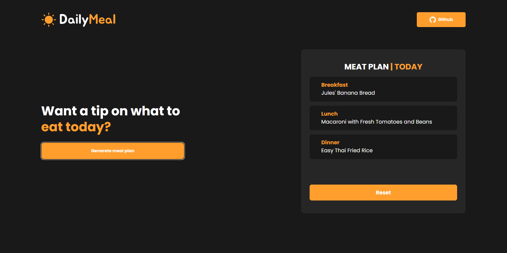

# 🥞 Daily Meal by _RouterDev_

#### **A browser based meal plan generator app** that allows the user to generate a healthy meal of the day

---

## Product features 📷

 

---

### The Motivation for Development

Having a regulated and healthy diet is the first step towards better health and increased productivity, but many people have no idea of ​​how many meals to have in a day or what to wait for, so together with a healthy food API we have produced a generator for planning meals main meals of the day and 100% healthy.

**This application is also part of our personal project, which consists of making one application per week.**

This is the week 1 project. If you want to know more about our project here is a link for you to follow:

- [PROJECT ONE WEEK](https://github.com/aquiname) 💻

---

### How to configure

## Clone Repository

    git clone https://github.com/revogabe/DailyMeal

## Front-end

    cd FrontEnd

Install Dependencies:

    yarn install

Run Front:

    yarn run dev

## Back-end

    cd BackEnd

Install Dependencies:

    npm install

Run Server:

    npm start

---

## 🌐 Technologies used

- [Spoonacular API](https://spoonacular.com/)
- [ReactJS + Vite](https://vitejs.dev/)
- [Axios](https://axios-http.com/)
- [Tailwind](https://tailwindcss.com/)

---

## Authors

**RouterDev | Team Members**

- [Daniel Gabriel](https://github.com/revogabe)
- [Kelvin Quida](https://github.com/kazz2433)
